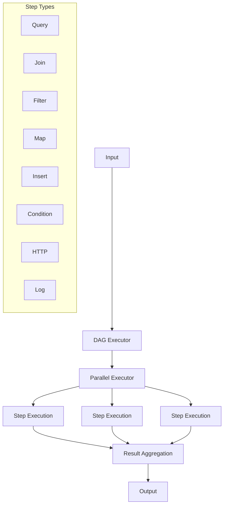

# Directed Acyclic Graph Execution Engine

## Architecture



## Features

- **Parallel Execution**: Executes independent steps seuqential or concurrently (if we can) based on their dependencies
- **Dependency Management**: Handles step dependencies and execution order
- **Input/Output Validation**: JSON schema validation for inputs and outputs
- **Error Handling**: Robust error collection from parallel executions
- **Step Result Tracking**: Thread-safe storage of intermediate results

## Supported Step Types

1. **Query**: Execute SQL queries with dynamic parameters
2. **Join**: Combine results from multiple steps
3. **Filter**: Filter data based on conditions
4. **Map**: Transform data using mapping functions
5. **Insert**: Insert data into database tables
6. **Condition**: Conditional branching in the workflow
7. **HTTP**: Make HTTP requests to external services
8. **Log**: Log messages and data for debugging

## Execution Flow

1. **Input Validation**: Validates input data against the defined schema
2. **Entry Step**: Begins execution from the specified entry point
3. **Parallel Processing**:
   - Tracks step dependencies
   - Executes independent steps concurrently
   - Monitors step completion
   - Manages execution order
4. **Result Collection**: Aggregates results from all steps
5. **Output Validation**: Validates final output against the schema

## DAG Definition Example

```json
{
  "entry": "step1",
  "result": "step3",
  "steps": [
    {
      "id": "step1",
      "type": "query",
      "params": {
        "table": "users",
        "select": ["id", "name"]
      }
    },
    {
      "id": "step2",
      "type": "filter",
      "dependsOn": ["step1"],
      "params": {
        "condition": "age > 18"
      }
    },
    {
      "id": "step3",
      "type": "map",
      "dependsOn": ["step2"],
      "params": {
        "function": "formatUser"
      }
    }
  ]
}
```
